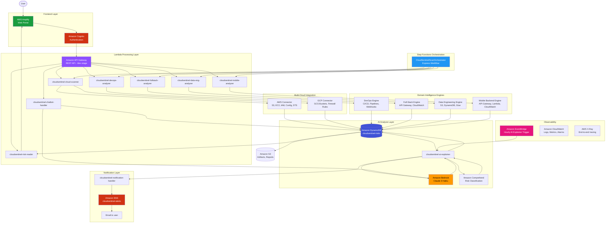
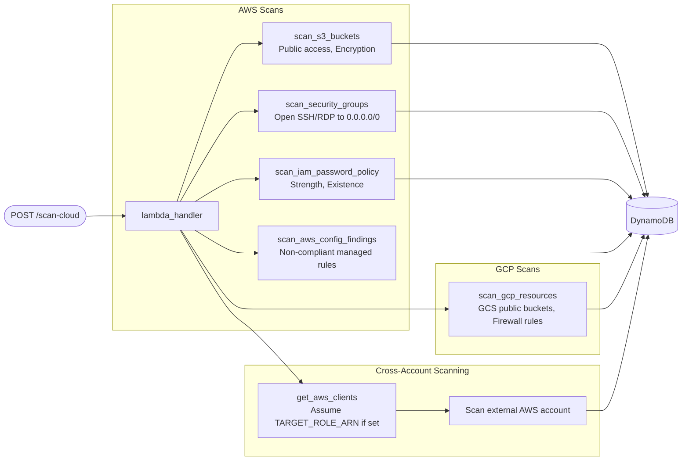
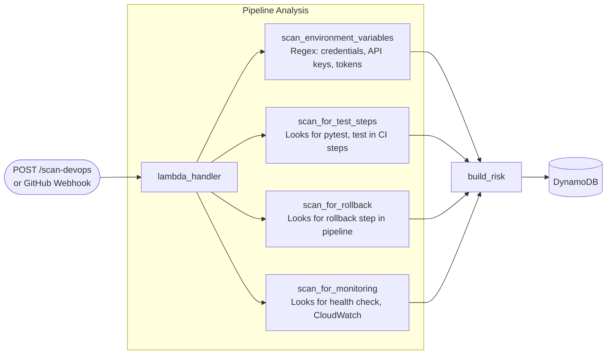
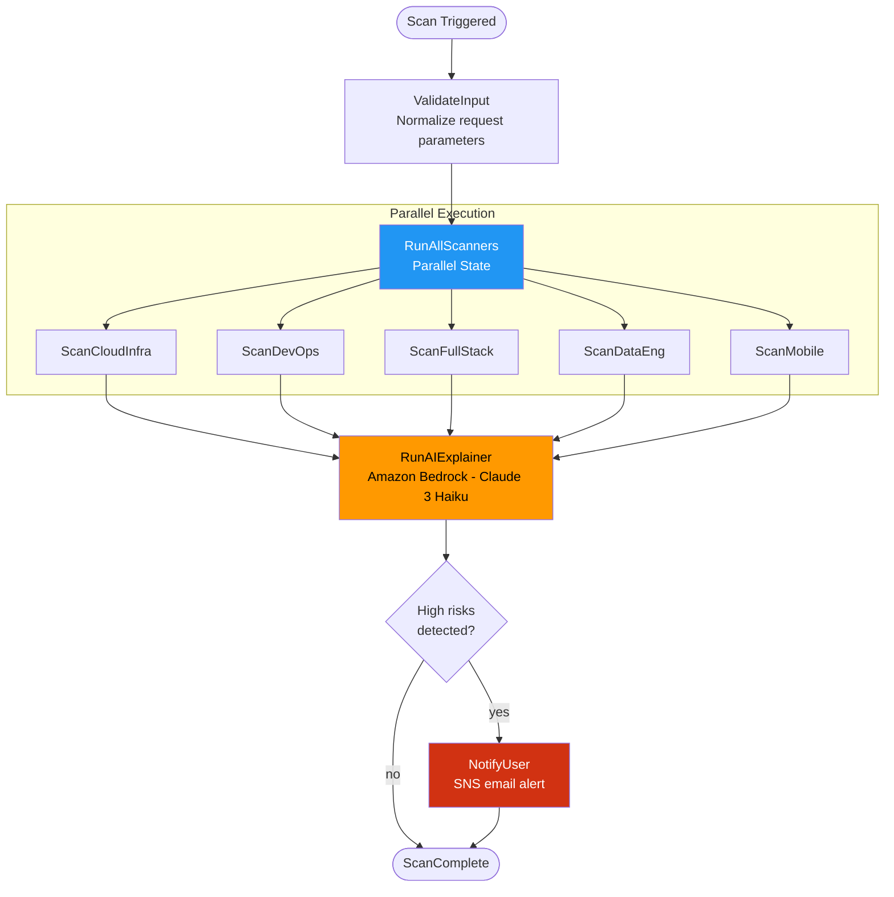
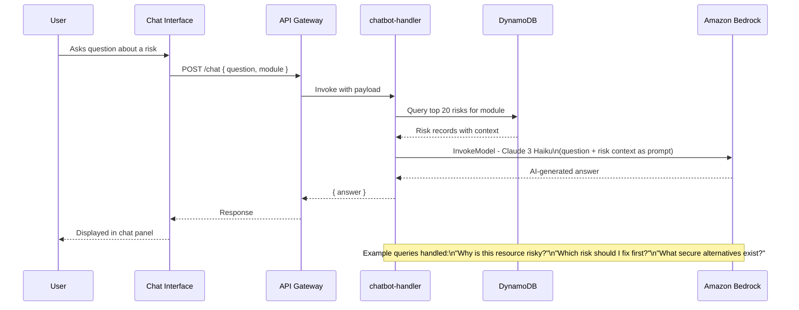
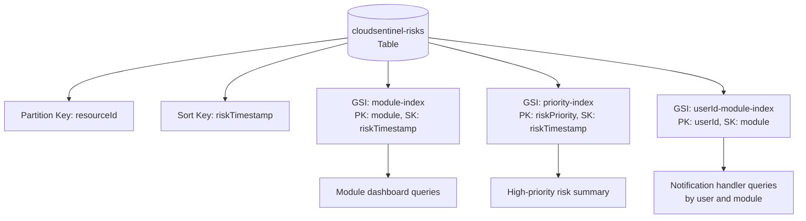
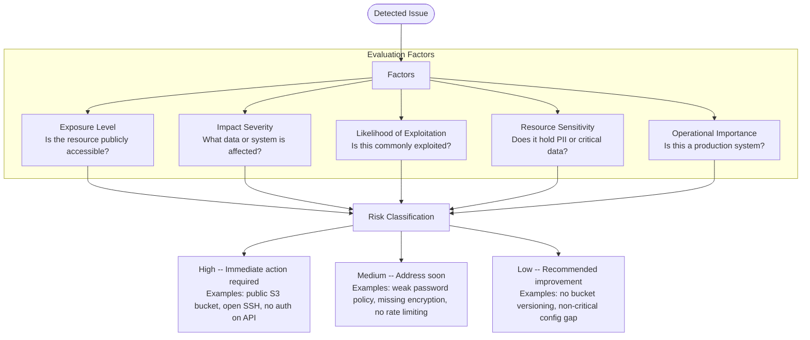
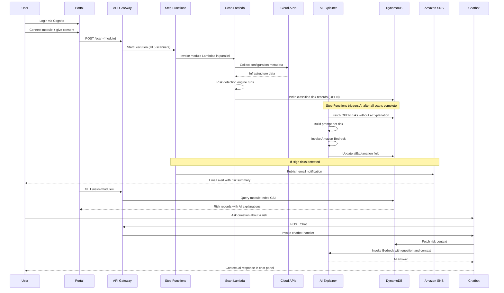
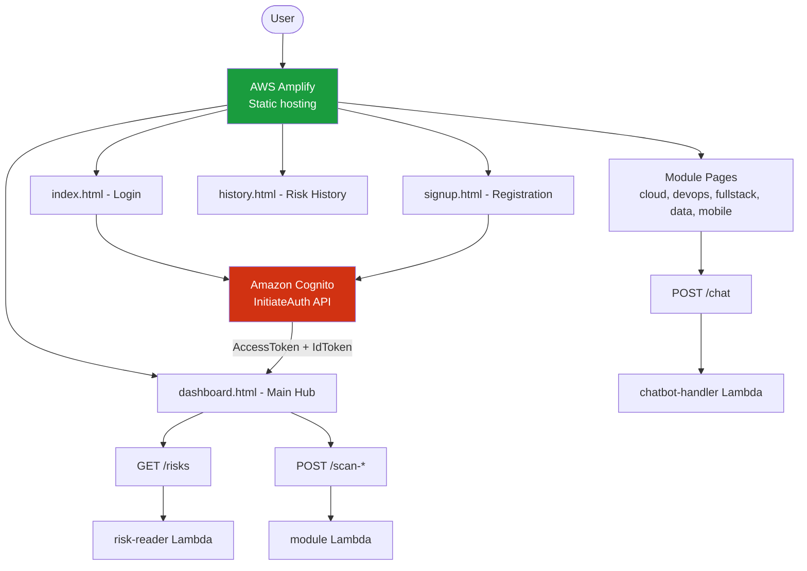

# CloudSentinel -- Architecture

> AI-Powered Multi-Cloud Engineering Risk Intelligence Platform

---

## Table of Contents

- [Problem Statement](#problem-statement)
- [Project Overview](#project-overview)
- [Objectives](#objectives)
- [System Architecture](#system-architecture)
- [Module Architectures](#module-architectures)
- [Step Functions Orchestration](#step-functions-orchestration)
- [AI Chatbot Architecture](#ai-chatbot-architecture)
- [Risk Intelligence Model](#risk-intelligence-model)
- [Risk Prioritization Logic](#risk-prioritization-logic)
- [System Workflow](#system-workflow)
- [Frontend Architecture](#frontend-architecture)
- [Session and Security Model](#session-and-security-model)
- [Platform Modules](#platform-modules)
- [Technologies and Services](#technologies-and-services)
- [Expected Outcomes](#expected-outcomes)

---

## Problem Statement

When you are running infrastructure across multiple cloud services, things go wrong quietly. S3 buckets get misconfigured. Security groups accumulate open ports. CI/CD pipelines grow hardcoded secrets over time. Data buckets lose their encryption settings after an update. These issues rarely announce themselves — they show up later, usually at the worst possible moment.

The harder problem is that existing monitoring tools generate a lot of noise but very little signal. You get an alert, you look at the resource, and you still do not know if it is actually dangerous or how urgent it is. If you are a backend developer and the alert is about a Glue job failure, you might not even know where to start.

We built CloudSentinel because we wanted a tool that not only finds these issues but explains them in language that any engineer can act on, regardless of which part of the stack they work in.

---

## Project Overview

CloudSentinel is a fully serverless platform running on AWS. Each of the five engineering domains has its own Lambda-based scanner. When a scan runs, AWS Step Functions coordinates all five scanners in parallel — what would take around 10 minutes running sequentially finishes in 2–3 minutes this way.

Detected risks get stored in DynamoDB. An AI explainer Lambda then picks up each risk record and calls Amazon Bedrock (Claude 3 Haiku) to write a plain-language explanation and remediation guide. Amazon Comprehend classifies the risk into a category. When High-priority risks are found, Amazon SNS sends an email alert to the account owner.

The frontend is a static web portal on AWS Amplify, authenticated through Amazon Cognito. Each module has its own dashboard page showing risk cards. There is also an AI chatbot on every module page that lets you ask questions about what was detected and get contextual answers back from the same Claude model.

---

## Objectives

- Detect infrastructure and operational risks across five engineering domains from a single platform
- Support multi-cloud scanning across AWS and GCP environments
- Generate AI-powered explanations for every detected risk using Amazon Bedrock
- Prioritize risks by severity so teams can focus on what matters most
- Deliver actionable remediation guidance with concrete steps and alternatives
- Send real-time email notifications when High-priority risks are detected
- Enable interactive troubleshooting through an AI assistant chatbot

---

## System Architecture

The platform is composed of six integrated layers: presentation, authentication, API, compute, AI analysis, and data.



---

## Module Architectures

### Cloud Infrastructure Intelligence

**Module:** Cloud Infrastructure and AI Layer -- Lambda: `cloudsentinel-cloud-scanner`



---

### DevOps Intelligence

**Module:** DevOps Intelligence -- Lambda: `cloudsentinel-devops-analyzer`



---

### Full-Stack Application Intelligence

**Module:** Full-Stack Application Intelligence -- Lambda: `cloudsentinel-fullstack-analyzer`


---

### Data Engineering Intelligence

**Module:** Data Engineering Intelligence -- Lambda: `cloudsentinel-data-eng-analyzer`


---

### Mobile Backend Intelligence

**Module:** Mobile Backend Intelligence -- Lambda: `cloudsentinel-mobile-analyzer`

```mermaid
flowchart LR
    Trigger([POST /scan-mobile]) --> Handler[lambda_handler]

    subgraph API Metrics
        Handler --> Lat[scan_api_latency\np95 > 1000ms - High]
        Handler --> Err5[scan_error_rates 5XX\nSum > 10/hr - High]
        Handler --> Err4[scan_error_rates 4XX\nSum > 50/hr - Medium]
    end

    subgraph CORS
        Handler --> CORS[scan_cors_config\nOPTIONS method missing - Medium]
    end

    subgraph Lambda Health
        Handler --> LErr[scan_lambda_errors\nErrors > 5/hr per function - High]
    end

    Lat --> DDB[(DynamoDB)]
    Err5 --> DDB
    Err4 --> DDB
    CORS --> DDB
    LErr --> DDB
```

---

## Step Functions Orchestration

AWS Step Functions coordinates the full scan pipeline using an Express workflow. All five module scanners run in parallel, which reduces total scan time from ~10 minutes (sequential) to approximately 2-3 minutes.



Each Lambda state has exponential backoff retry (3 attempts, 2x multiplier). Failures in individual scanners are caught and do not stop the rest of the workflow. X-Ray tracing and CloudWatch logs are enabled on the state machine.

---

## AI Chatbot Architecture



---

## Risk Intelligence Model

Every detected issue is stored as a structured risk record in DynamoDB.

```json
{
  "resourceId":           "cloud-infra-s3-bucket-my-bucket",
  "riskTimestamp":        "2024-01-15T10:30:00Z",
  "scanId":               "scan-uuid",
  "userId":               "user-uuid",
  "module":               "cloud-infra",
  "cloudProvider":        "AWS",
  "resource":             "S3 Bucket",
  "resourceName":         "my-bucket",
  "riskType":             "S3 Public Access Not Fully Blocked",
  "riskReason":           "One or more Block Public Access settings are disabled on this bucket.",
  "riskPriority":         "High",
  "remediationSteps":     ["Enable all four Block Public Access settings", "Review bucket policy"],
  "alternativeSolutions": ["Use pre-signed URLs", "Serve via CloudFront with OAC"],
  "aiExplanation":        "Filled by ai-explainer Lambda via Amazon Bedrock",
  "riskCategory":         "Filled by Amazon Comprehend",
  "status":               "OPEN",
  "notified":             false,
  "region":               "us-east-1"
}
```

### DynamoDB Table Structure



**Status values:** `OPEN`, `IN_PROGRESS`, `RESOLVED`
**Priority values:** `High`, `Medium`, `Low`
**Module values:** `cloud-infra`, `devops`, `fullstack`, `data-eng`, `mobile`

---

## Risk Prioritization Logic



---

## System Workflow



---

## Frontend Architecture

**Module:** Frontend Portal -- Hosting: AWS Amplify



The frontend uses plain HTML, CSS, and JavaScript with no framework dependencies. It supports light and dark mode, a session idle timeout (30 minutes default, user-configurable), and stores scan history locally in the browser. The AI chatbot panel is embedded on every module page.

---

## Session and Security Model

The frontend implements a layered security approach:

**Authentication:**
- Amazon Cognito handles identity -- user pool with email-based sign-in
- JWT tokens (Access + ID) stored in memory, refresh token in localStorage
- Demo mode for local development -- any credentials are accepted when Cognito is not configured

**Session management:**
- Idle timeout defaults to 30 minutes
- Session countdown timer visible in navbar at all times
- Activity events (mouse, keyboard, scroll) reset the timer
- Warning modal appears at 60 seconds remaining
- Session settings let users extend to 15 minutes up to 8 hours
- Auto-logout redirects to login page with `reason=timeout` in URL

**Login security:**
- Client-side rate limiting: 3 failed attempts = 60 second lockout, 5 attempts = 5 minute lockout, 10 attempts = 30 minute lockout
- Attempt counter shown after the second failed attempt
- Live countdown timer during lockout period
- Email format validation before API call

**Cloud connection security:**
- AWS connections use CloudFormation or Terraform to deploy a read-only IAM role
- The role uses an External ID to prevent confused deputy attacks
- GCP connections use a service account JSON stored in AWS Secrets Manager
- Users explicitly consent before access is granted
- Disconnect option removes the cross-account role stack from the user's account

---

## Platform Modules

| Module | Lambda | Owner | Key Detections |
|--------|--------|-------|----------------|
| Cloud Infrastructure | `cloudsentinel-cloud-scanner` | Cloud Infrastructure and AI Layer | Public S3 buckets, open security groups, weak IAM, GCP firewall |
| DevOps Intelligence | `cloudsentinel-devops-analyzer` | DevOps Intelligence | Hardcoded secrets, missing tests, no rollback, no monitoring |
| Full-Stack Application | `cloudsentinel-fullstack-analyzer` | Full-Stack Intelligence | Unauthenticated APIs, no rate limiting, high 5XX, high latency |
| Data Engineering | `cloudsentinel-data-eng-analyzer` | Data Engineering Intelligence | Public data buckets, missing encryption, DynamoDB SSE off, Glue failures |
| Mobile Backend | `cloudsentinel-mobile-analyzer` | Mobile Backend Intelligence | High latency, error spikes, missing CORS, Lambda errors |
| Frontend Portal | AWS Amplify (static) | Frontend Portal | Dashboard, risk cards, AI chatbot, scan history, session management |

---

## Technologies and Services

### Cloud Platforms

| Platform | Status |
|----------|--------|
| Amazon Web Services (AWS) | Production |
| Google Cloud Platform (GCP) | Production (GCS + Firewall scanning) |
| Microsoft Azure | Planned for v2 |

### AWS Services

| Category | Service | Purpose |
|----------|---------|---------|
| AI / ML | Amazon Bedrock (Claude 3 Haiku) | Risk explanations, chatbot responses |
| AI / ML | Amazon Comprehend | Risk category classification |
| Orchestration | AWS Step Functions | Parallel scan coordination, AI trigger, SNS routing |
| Alerting | Amazon SNS | Email notifications on High risk detection |
| Hosting | AWS Amplify | Frontend portal |
| Authentication | Amazon Cognito | User identity and session management |
| API | Amazon API Gateway | Frontend to backend communication |
| Compute | AWS Lambda (Python 3.11) | Risk detection, AI processing, API handling |
| Database | Amazon DynamoDB | Structured risk record storage |
| Storage | Amazon S3 | Logs, reports, scan artifacts |
| Monitoring | Amazon CloudWatch | Metrics, logs, alarms |
| Tracing | AWS X-Ray | End-to-end request tracing |
| Events | Amazon EventBridge | Hourly AI explainer trigger, scan-complete events |
| Security | AWS IAM | Role-based access control |
| Security | AWS STS | Cross-account scanning credentials |
| Security | AWS Secrets Manager | GCP credentials, webhook secrets |
| Governance | AWS Config | Non-compliant resource detection |
| IaC | Terraform | Full infrastructure deployment |
| CI/CD | GitHub Actions | Automated testing and Bandit security scan |

---

## Expected Outcomes

The goal was to build something we would actually use ourselves. Whether that is checking an S3 bucket configuration before a deployment, verifying that a Glue job has not been silently failing, or asking the chatbot why a particular API endpoint was flagged — the platform should make that faster and clearer than looking it up manually.

More specifically, by the end of this project we wanted to have:

- A single portal where you can see risks across all five engineering domains without switching between services
- AI explanations that are specific to the detected issue, not just generic documentation summaries
- Email alerts that arrive quickly enough to be useful — not summaries delivered hours after the fact
- Remediation steps that are actionable and tell you the exact setting or command to run
- A chatbot that understands the context of your detected risks, not just generic cloud questions

The combination of Step Functions orchestration, domain-specific scanners, Bedrock explanations, Comprehend classification, and SNS alerts is what makes this more than just another monitoring dashboard.
