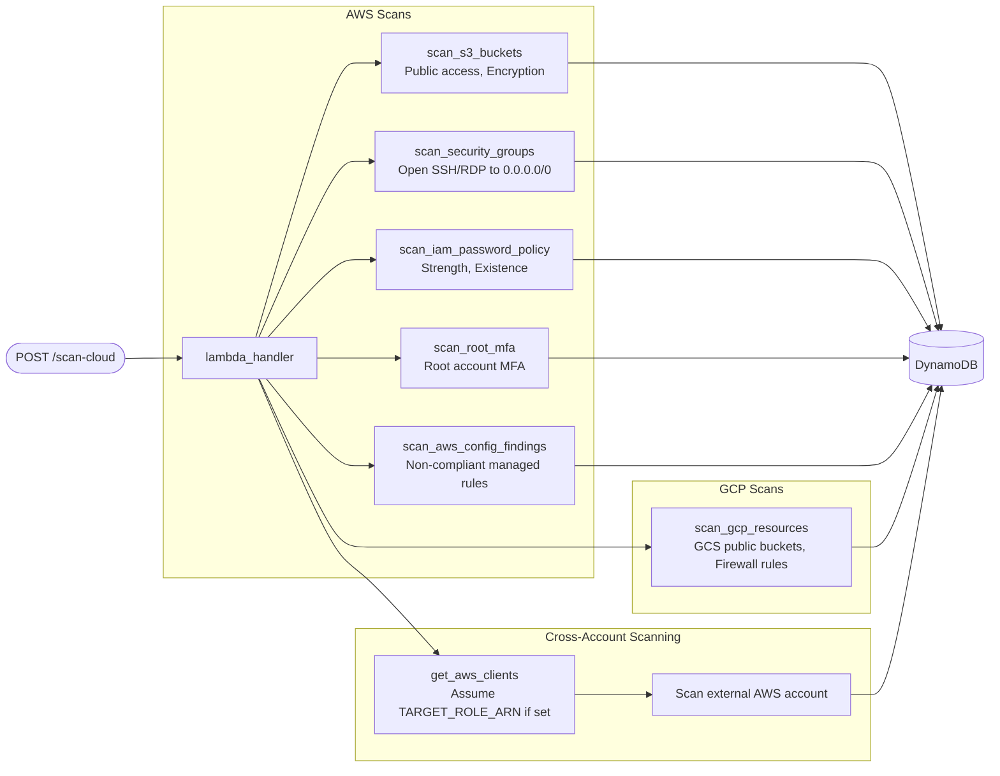
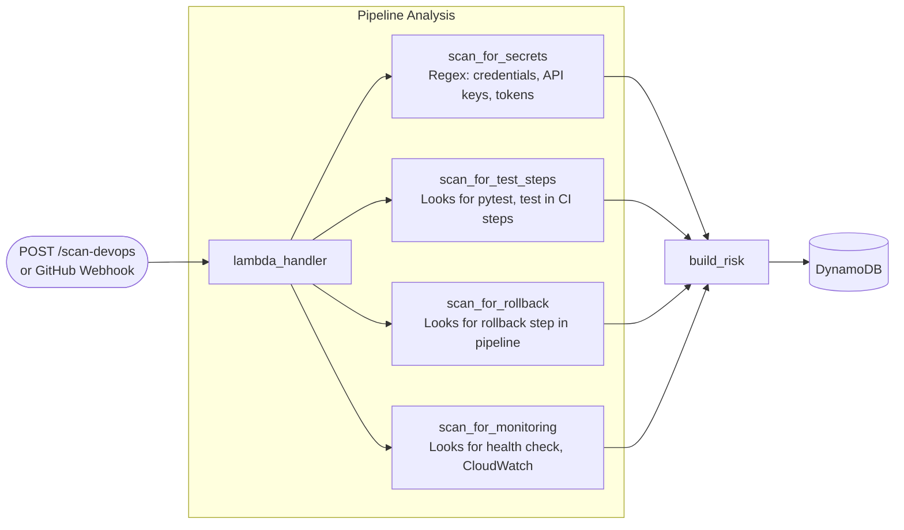
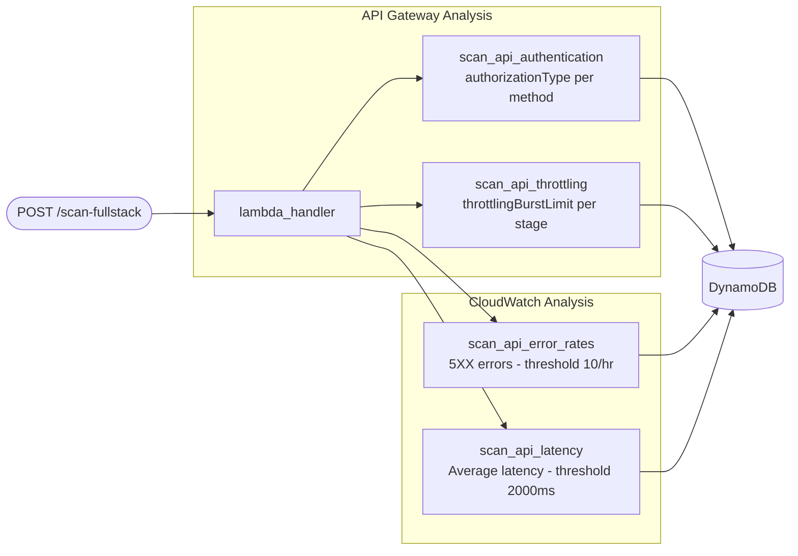
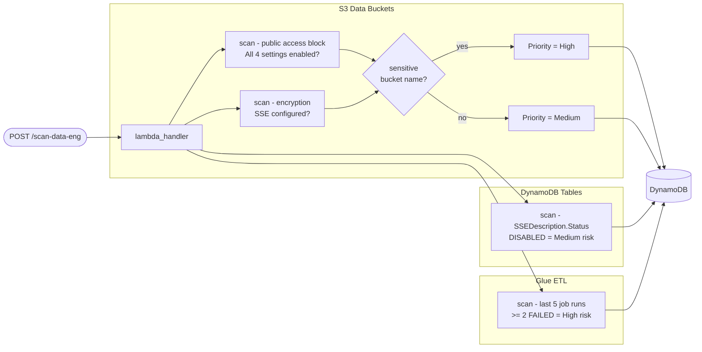
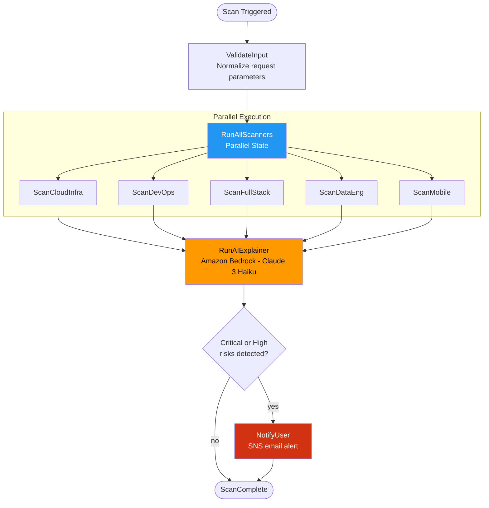
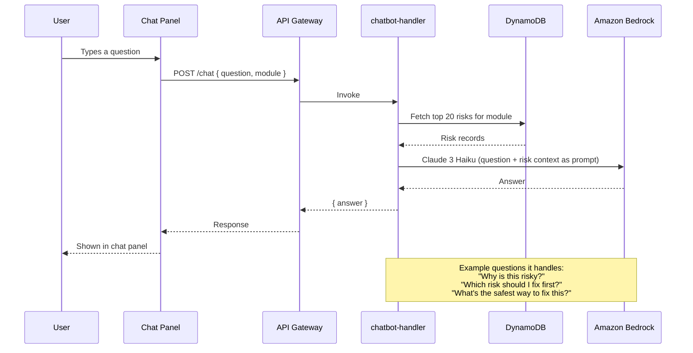
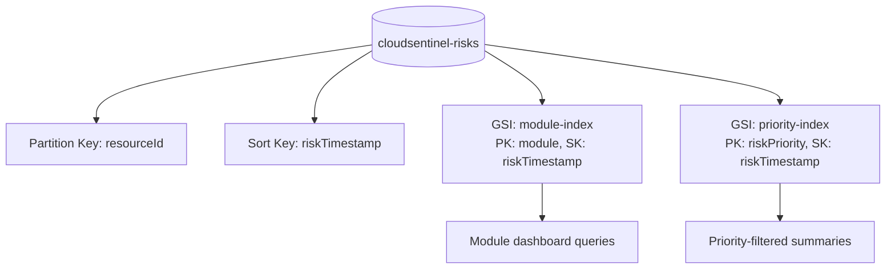
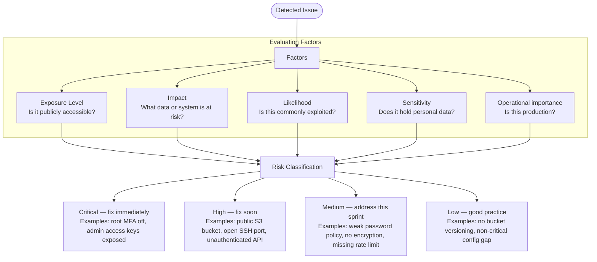
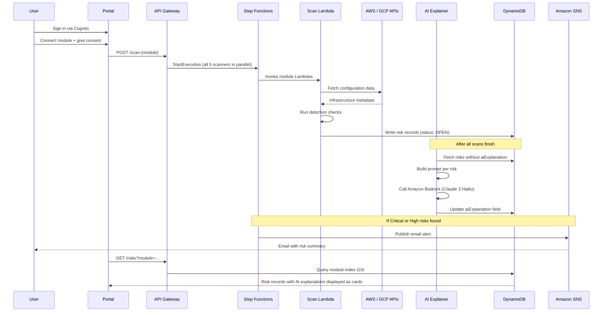
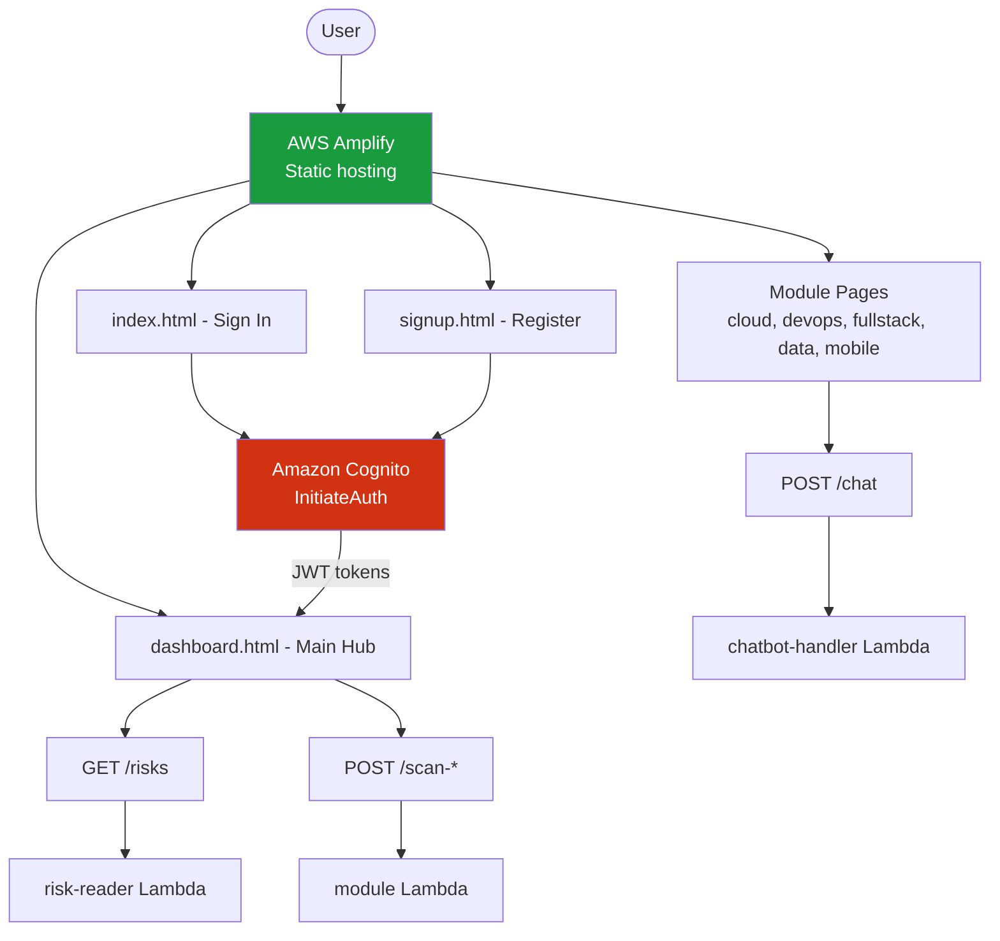

# CloudSentinel AI — Architecture

> How we built it, why we made the decisions we did, and how everything connects.

---

## Table of Contents

- [Why we built this](#why-we-built-this)
- [What it does](#what-it-does)
- [System Architecture](#system-architecture)
- [Module Architectures](#module-architectures)
- [Step Functions Orchestration](#step-functions-orchestration)
- [AI Chatbot](#ai-chatbot)
- [Risk Data Model](#risk-data-model)
- [Risk Prioritization](#risk-prioritization)
- [Full System Workflow](#full-system-workflow)
- [Frontend Architecture](#frontend-architecture)
- [Security and Session Model](#security-and-session-model)
- [Module Summary](#module-summary)
- [Technologies Used](#technologies-used)
- [What we set out to achieve](#what-we-set-out-to-achieve)

---

## Why we built this

The biggest source of real cloud breaches is not sophisticated zero-day exploits. It is misconfigured infrastructure. S3 buckets left open, security groups with port 22 open to the world, CI/CD pipelines where someone committed an API key six months ago and it's still there. These are detectable. They just require someone to actually check.

The problem with existing tools is that they either cost too much for a student or small team to use, or they dump a wall of alerts without any explanation of why something matters. If you're a mobile developer who suddenly sees `DynamoDB table SSEDescription.Status = DISABLED` flagged as a risk — that means nothing to you unless someone explains what SSE is, why it matters for your table specifically, and what you need to click to fix it.

We wanted a tool that finds these issues AND explains them in plain language using AI, with actual remediation steps — not just a link to the AWS docs.

---

## What it does

Six of us built this over a semester, each owning one domain:

- **Sameer** — Cloud Infrastructure (AWS + GCP scanning, AI explainer, chatbot, platform)
- **Vivek** — DevOps Intelligence (GitHub Actions CI/CD pipeline analysis)
- **Gowrish** — Full-Stack Intelligence (API Gateway, throttling, error rates)
- **Ayyan** — Data Engineering (DynamoDB, S3 data buckets, Glue ETL jobs)
- **Ambica** — Mobile Backend (Cognito, Lambda, mobile API latency)
- **Akash** — Frontend Portal (dashboard, module pages, session management)

When you trigger a scan, all five scanners run simultaneously in parallel using AWS Step Functions. Instead of taking 10 minutes sequentially, it finishes in 2–3 minutes. Every detected risk gets stored in DynamoDB, then an AI explainer Lambda processes each one with Claude 3 Haiku to write a plain-English explanation and step-by-step fix. If anything Critical or High comes up, an SNS email goes out immediately.

---

## System Architecture

The platform has six layers: frontend, auth, API, compute, AI, and data.


---

## Module Architectures

### Cloud Infrastructure (Sameer)

This is the core scanner. It covers AWS and optionally GCP if a service account key is configured. Cross-account scanning works by assuming a read-only IAM role in the target account — the CloudFormation template in `infrastructure/cloudformation/` creates that role in the client's account.



---

### DevOps Intelligence (Vivek)

Vivek's module analyzes CI/CD pipeline configuration files — primarily GitHub Actions YAML. It supports two modes: manual (you POST the config) and webhook (GitHub pushes it on every commit). The webhook mode verifies the HMAC signature before processing, so we're not just accepting arbitrary payloads.



---

### Full-Stack Intelligence (Gowrish)

Gowrish's module checks API Gateway configuration and CloudWatch metrics. The key thing it looks for is unauthenticated endpoints — any API method where `authorizationType == NONE` and `apiKeyRequired == false` is fully open to the internet.

He also agreed with Ambica on the latency threshold: web gets 2000ms, mobile gets 1000ms, based on Google's Core Web Vitals research.



---

### Data Engineering (Ayyan)

Ayyan's module focuses on protecting data. It uses bucket name analysis (not content inspection) to find potentially sensitive S3 buckets — this keeps the permissions minimal and avoids reading actual data. The threshold for Glue job failures is 2 in the last 5 runs, because a single failure is usually transient but repeated failures mean something is actually broken.



---

### Mobile Backend (Ambica)

Ambica's module is similar to Gowrish's full-stack scanner but tuned for mobile clients. The 1000ms latency threshold comes from Firebase Performance Monitoring's recommendation. She also added CORS detection because Flutter Web apps running in a browser are subject to the same preflight rules as any other browser client.

The distinction between her error detection and Gowrish's: she looks at per-function Lambda errors, he looks at API Gateway 5XX. Together they catch more cases.

```mermaid
flowchart LR
    Trigger([POST /scan-mobile]) --> Handler[lambda_handler]

    subgraph API Metrics
        Handler --> Lat[scan_api_latency\np95 > 1000ms - High]
        Handler --> Err5[scan_error_rates 5XX\nSum > 10/hr - High]
        Handler --> Err4[scan_error_rates 4XX\nSum > 50/hr - Medium]
    end

    subgraph CORS
        Handler --> CORS[scan_cors_config\nOPTIONS method missing - Medium]
    end

    subgraph Lambda Health
        Handler --> LErr[scan_lambda_errors\nErrors > 5/hr per function - High]
    end

    Lat --> DDB[(DynamoDB)]
    Err5 --> DDB
    Err4 --> DDB
    CORS --> DDB
    LErr --> DDB
```

---

## Step Functions Orchestration

Running five scanners sequentially would take around 10 minutes. With Step Functions parallel execution it finishes in 2–3 minutes. Each scanner Lambda runs independently and writes to DynamoDB directly — failures in one don't stop the others.



Each Lambda state has exponential backoff retry (3 attempts, 2x multiplier). X-Ray tracing and CloudWatch logs are enabled on the state machine.

---

## AI Chatbot

The chatbot isn't a generic cloud assistant — it has context. When you ask a question, the chatbot Lambda pulls your top 20 most recent risks from DynamoDB and injects them as context into the Bedrock prompt. So when you ask "why is this risky?" it can answer based on the specific resources that were actually flagged in your environment.



---

## Risk Data Model

Every detected issue is stored as a structured record in DynamoDB.

```json
{
  "resourceId":           "cloud-infra-s3-my-bucket",
  "riskTimestamp":        "2025-06-01T10:30:00Z",
  "module":               "cloud-infra",
  "cloudProvider":        "AWS",
  "resource":             "S3 Bucket",
  "resourceName":         "my-bucket",
  "riskType":             "S3 Public Access Not Fully Blocked",
  "riskReason":           "One or more Block Public Access settings are disabled.",
  "riskPriority":         "High",
  "remediationSteps":     ["Enable all four Block Public Access settings", "Review bucket policy"],
  "alternativeSolutions": ["Use pre-signed URLs for sharing", "Serve via CloudFront with OAC"],
  "aiExplanation":        "filled by ai-explainer via Amazon Bedrock",
  "riskCategory":         "filled by Amazon Comprehend",
  "postureScore":         72,
  "status":               "OPEN",
  "notified":             false,
  "region":               "us-east-1"
}
```

### DynamoDB table design



**Status values:** `OPEN`, `IN_PROGRESS`, `RESOLVED`
**Priority values:** `Critical`, `High`, `Medium`, `Low`
**Modules:** `cloud-infra`, `devops`, `fullstack`, `data-eng`, `mobile`

---

## Risk Prioritization

Sameer introduced a Security Posture Score (0–100) to give a single number that represents overall account health — useful for the paper and also easier to explain to a non-technical audience than a list of individual risk counts.

**Posture score formula:**
```
Score = 100 − (20 × Critical + 10 × High + 5 × Medium + 2 × Low)
Minimum: 0
```

Individual risks are classified based on:



---

## Full System Workflow



---

## Frontend Architecture

Akash built the frontend as plain HTML/CSS/JS — no framework. It supports dark and light mode (Akash's addition), a configurable session timer, and stores scan history locally in the browser. The AI chatbot panel is embedded on every module page, not just the main dashboard.



---

## Security and Session Model

We tried to get the security properties right — not just functional auth, but actually secure.

**Authentication:**
- Cognito User Pools with email-based sign-in
- JWT tokens (Access + ID) stored in memory; refresh token in localStorage
- 30-minute token expiry enforced server-side by Cognito AND API Gateway — not just a frontend timer

**Session management:**
- Idle timeout defaults to 30 minutes
- Activity events (mouse, keyboard, scroll) reset the timer
- Warning modal at 60 seconds remaining
- Users can adjust timeout between 15 minutes and 8 hours
- On expiry: frontend calls `/disconnect`, which revokes all cloud credentials

**Login security:**
- Client-side rate limiting: 3 failed attempts = 60-second lockout, 5 = 5 minutes, 10 = 30 minutes
- Failed attempt count shown after the second failure
- Email format validated before any API call

**Cloud connection security:**
- AWS: cross-account role deployed via CloudFormation — read-only, with an External ID to prevent confused deputy attacks
- GCP: service account JSON key stored in AWS Secrets Manager — never touches the frontend
- Disconnect: CloudFormation stack deleted, GCP secret force-purged, all DynamoDB risk records cleared

---

## Module Summary

| Module | Lambda | Owner | What it checks |
|--------|--------|-------|----------------|
| Cloud Infrastructure | `cloudsentinel-cloud-scanner` | Sameer | S3, EC2, IAM, root MFA, GCP buckets and firewalls |
| DevOps Intelligence | `cloudsentinel-devops-analyzer` | Vivek | Hardcoded secrets, missing tests, no rollback, no post-deploy monitoring |
| Full-Stack | `cloudsentinel-fullstack-analyzer` | Gowrish | Unauthenticated APIs, no throttling, 5XX error rate, high latency |
| Data Engineering | `cloudsentinel-data-eng-analyzer` | Ayyan | Sensitive public buckets, DynamoDB encryption off, Glue job failures |
| Mobile Backend | `cloudsentinel-mobile-analyzer` | Ambica | High latency, Lambda errors, CORS gaps, Cognito MFA |
| Frontend | AWS Amplify (static) | Akash | Dashboard, risk cards, chatbot, scan history, session timer |

---

## Technologies Used

### AWS Services

| Service | How we use it |
|---------|--------------|
| Amazon Bedrock (Claude 3 Haiku) | AI explanations + chatbot |
| Amazon Comprehend | Risk category classification |
| AWS Step Functions | Parallel scan coordination |
| Amazon SNS | Email alerts on Critical/High risks |
| AWS Amplify | Frontend hosting |
| Amazon Cognito | Auth, JWT tokens, forgot password |
| Amazon API Gateway | REST API, Cognito JWT authorizer on every route |
| AWS Lambda (Python 3.11) | All compute |
| Amazon DynamoDB | Risk records, GSI for module + priority queries |
| Amazon S3 | Artifacts, PDF reports |
| Amazon CloudWatch | Logs, metrics (scan timing, AI latency for paper) |
| AWS X-Ray | Request tracing |
| Amazon EventBridge | Hourly AI explainer trigger |
| AWS STS | Cross-account scanning |
| AWS Secrets Manager | GCP keys, webhook secrets |
| AWS Config | Non-compliant resource findings |
| AWS Security Hub | Compliance standards baseline |
| Terraform | Full infrastructure as code |
| GitHub Actions | CI: unit tests, Bandit, Terraform validate |

### Cloud coverage

| Cloud | Status |
|-------|--------|
| AWS | Full coverage across 5 domains |
| GCP | Cloud Storage + Compute Engine firewall scanning |
| Azure | Planned for v2 |

---

## What we set out to achieve

We wanted to build something we would actually use. Whether that's checking a bucket configuration before a deployment, figuring out why a Glue job stopped working, or asking the chatbot "is this actually dangerous or can I ignore it" — the platform should answer that faster and more clearly than going through the AWS console manually.

Specifically:

- A single portal covering all five domains without jumping between services
- AI explanations specific to the actual resource flagged, not generic documentation summaries
- Alerts that arrive fast enough to be actionable
- Remediation steps that tell you the exact setting or command, not just "fix your configuration"
- A chatbot that knows what's in your environment, not just what's in the AWS docs
- A quantitative posture score so you can see progress as you fix things

The combination of Step Functions parallel scanning, domain-specific detection, Bedrock explanations, Comprehend classification, posture scoring, and PDF reporting is what makes this more than a monitoring dashboard.
