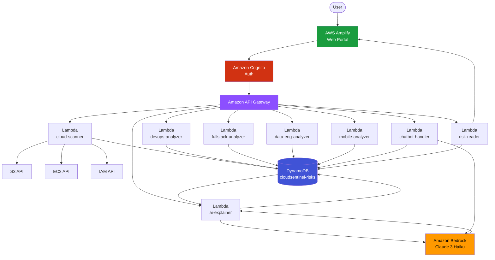
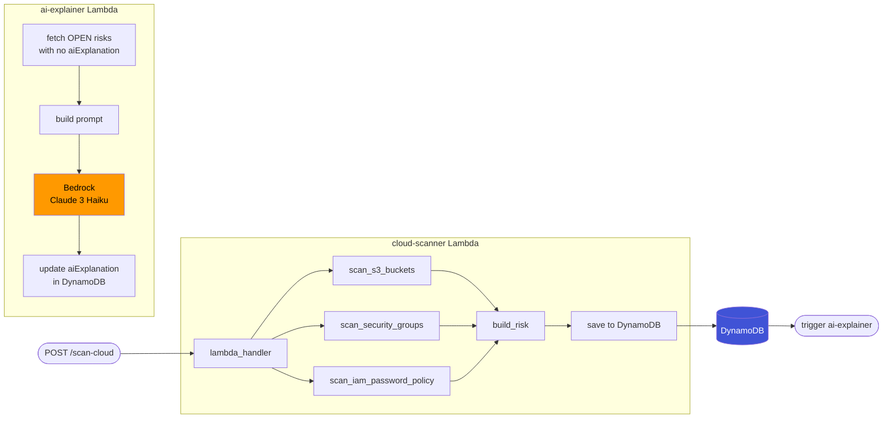
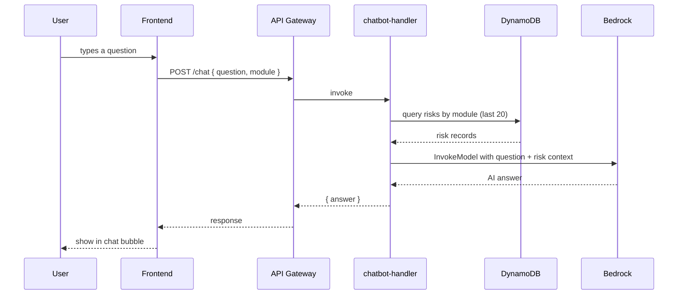
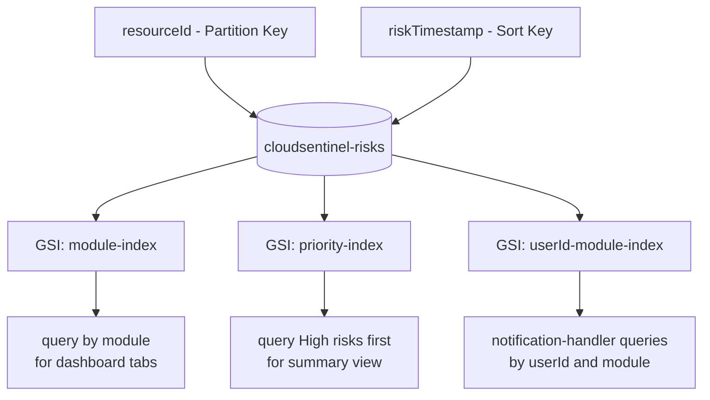
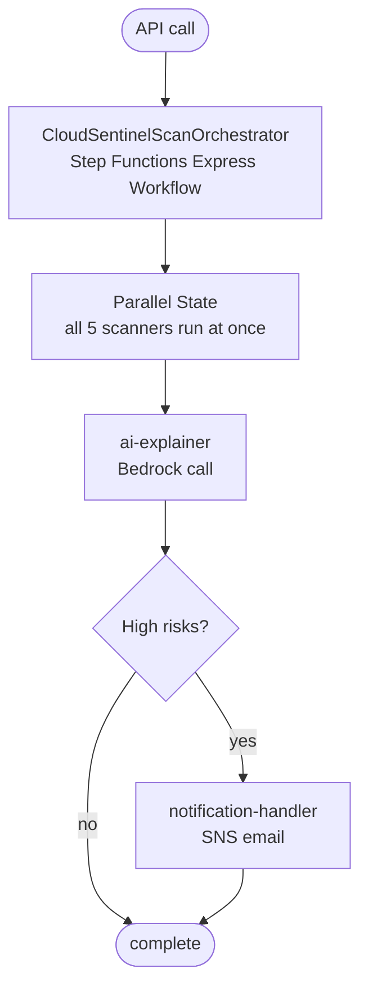
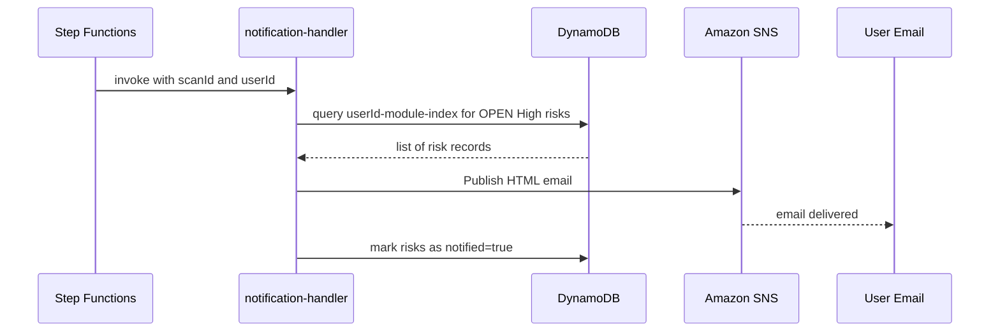

# Architecture Notes — Cloud Infra + AI Layer
## Sayyad Sameer

Wrote this out to make the overall system clear for the team. The cloud-infra module sits at the center — I own the shared infrastructure that everyone else connects to.

---

## How the whole system fits together

The idea is simple — every scan Lambda just reads from AWS APIs and writes to the same DynamoDB table. Then my ai-explainer Lambda goes through all the unprocessed risks and calls Bedrock to add the AI explanation. The frontend reads everything through the risk-reader Lambda.

---

## My module — cloud-scanner and the AI layer

---

## Chatbot flow — how it works

I pass the top 20 risks as context to the model so it can answer questions specifically about the user's environment, not generic cloud security stuff.

---

## DynamoDB structure

Three GSIs now. The userId-module-index is new — notification-handler needs it to pull open High risks for a specific user after a scan finishes.

---

## Step Functions orchestration (added in v2)

I added a Step Functions Express workflow to coordinate the scans. Before this, if you triggered a scan on the frontend it went directly to the Lambda. The problem is that all five module Lambdas run one after another on the same invocation, which is slow. With Step Functions, all five run in parallel inside a Parallel state.

Scan time went from about 10 minutes down to 2-3 minutes in practice. Each scanner state has a retry block with exponential backoff so transient AWS API throttles don't break the whole run.

---

## SNS email notification flow

When a scan finds High-priority risks, the notification-handler Lambda sends an email via SNS. The email has an HTML table listing the risks, a count by priority, and a direct link to the module dashboard.

The `notified=true` flag prevents the same risks from triggering another email on the next hourly EventBridge run. Threshold is configurable via Lambda env var — default is High only, can set to Medium or All.
