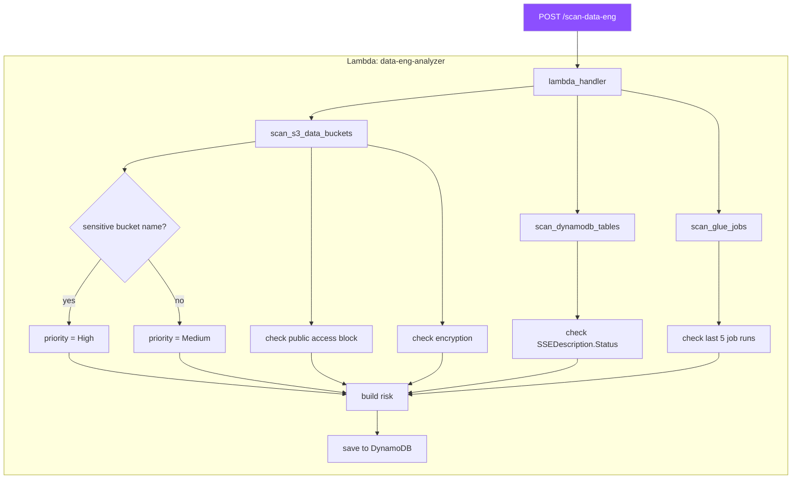
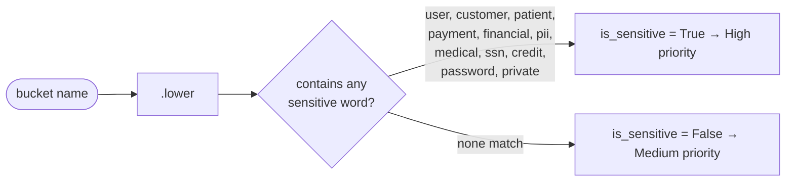
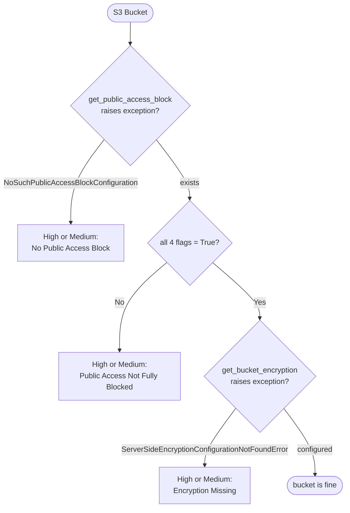
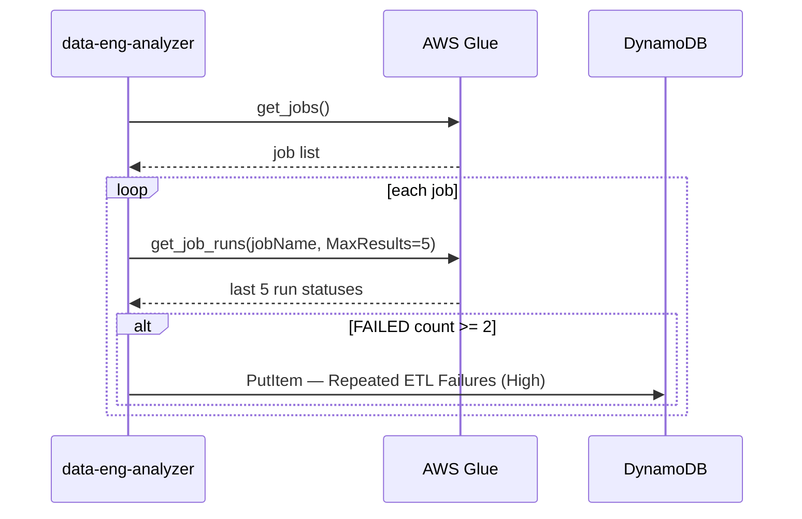

# Architecture — Data Engineering Intelligence
## Bikkavolu Srivallisa Sai Veerabhadra Ayyan

My module scans three services: S3, DynamoDB, and Glue. Here's how it works.

---

## Overall flow

---

## Sensitive name detection

This is one of the more interesting parts of my module. Instead of reading the contents of buckets (which would need data-level permissions and is way out of scope), I check if the bucket name contains words that suggest it holds sensitive data.

---

## S3 check decision tree

Priority depends on `is_sensitive` — if True, it's High, otherwise Medium.

---

## Glue failure detection

I check the last 5 runs because a single failure could be a fluke. Two or more failures in a row is a pattern worth raising.
