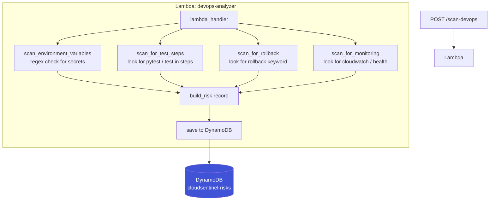
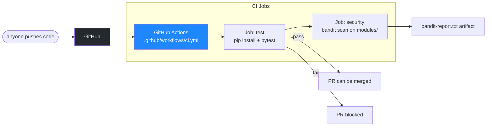
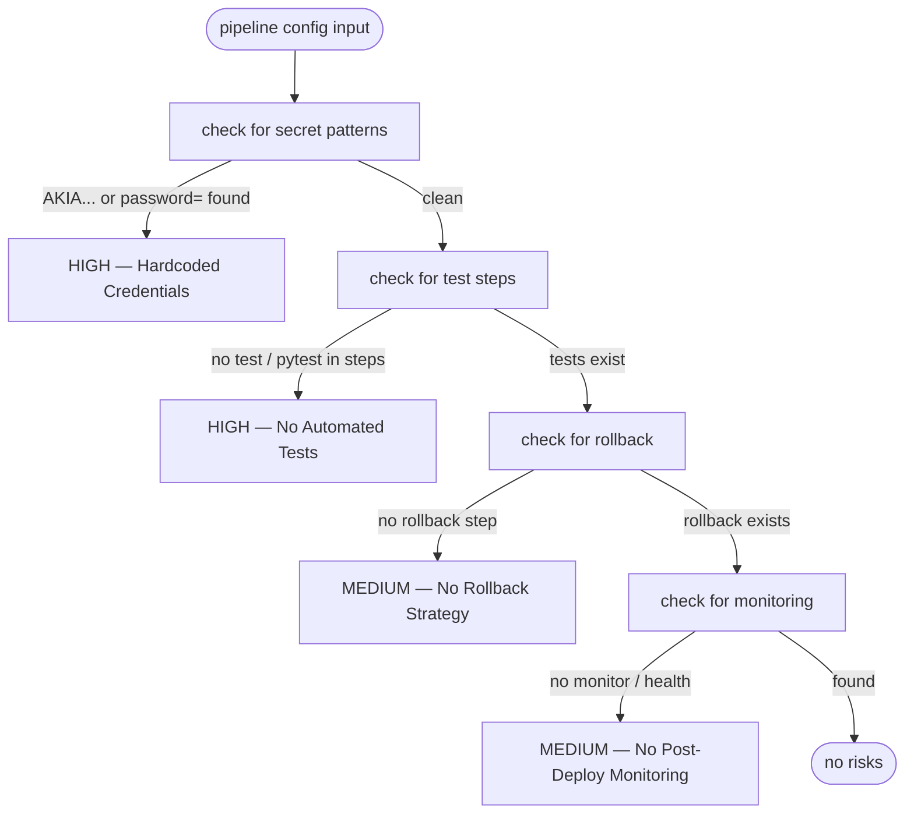
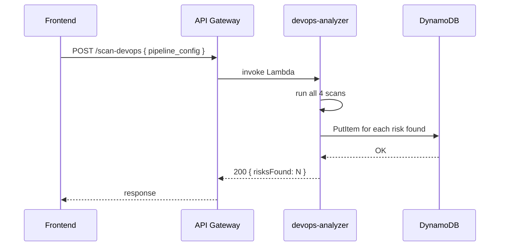

# Architecture — DevOps Intelligence
## Kantipudi Vivek Vardhan

Notes on how my module works. Drew these diagrams to explain the flow to myself and to have something ready for the demo.

---

## Module flow

---

## CI/CD pipeline I built for the team

I set it to `continue-on-error: true` on both jobs for now so a test failure doesn't completely block people. Once we stabilize, I'll make tests required before merge.

---

## How my risk detection logic decides priority

---

## Sequence from frontend trigger to DynamoDB

---

## Step Functions integration

Sameer added the orchestration layer using AWS Step Functions. From my side, my Lambda now gets invoked as one of five parallel branches inside the workflow instead of being called directly. My Lambda code didn't change at all — the Step Functions state machine just calls it like any other Lambda invocation, passing the same payload.

The main benefit is that all five scanners run at the same time. Previously if someone triggered all five scans the wait was sequential. The workflow also handles retries at the state machine level, so my Lambda doesn't need to implement its own retry logic for transient failures.

I also own `infrastructure/terraform/step_functions.tf` with Sameer since I wrote the DevOps scanner state in the Parallel block.
