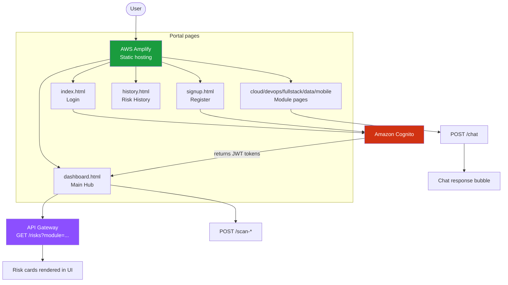
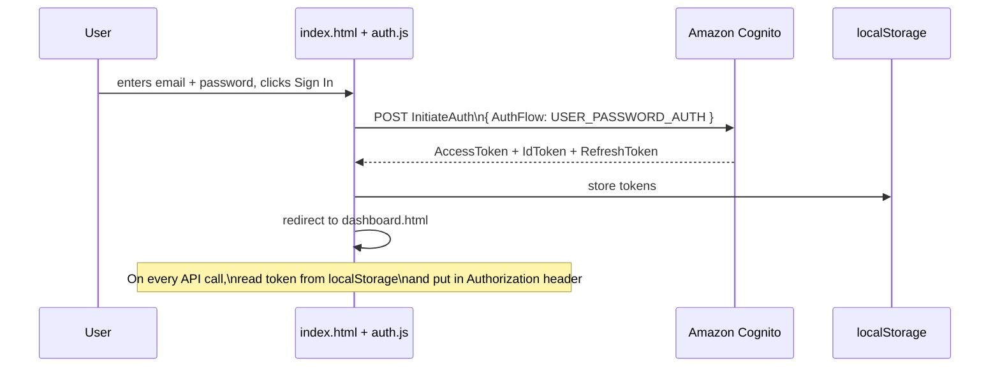
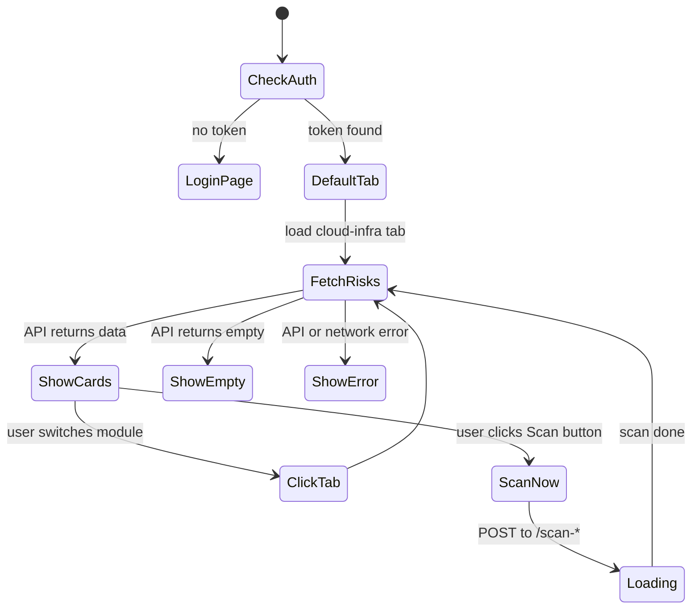
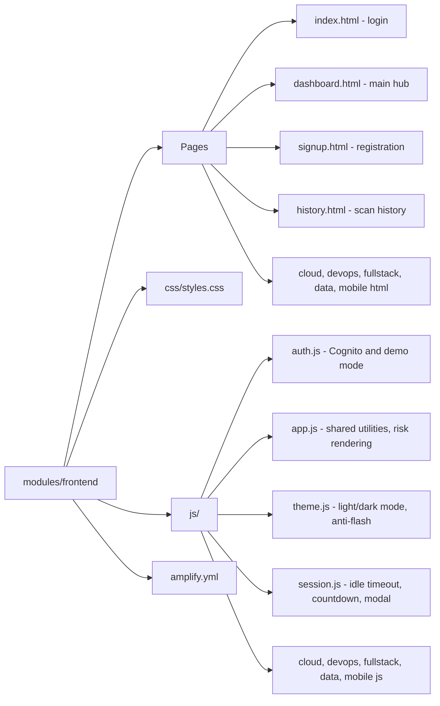
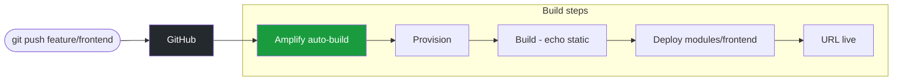

# Architecture — Frontend Portal
## Bogavalli Akash

How the portal is structured, how it connects to the backend, and what I added in v2.

---

## Overall flow

---

## Login flow in detail

---

## Dashboard tab state

---

## File structure

---

## Amplify build pipeline

No npm build step needed since it's pure HTML/CSS/JS. Amplify just copies the files.

---

## Session management and security (v2)

I added a proper session timeout system because leaving the dashboard open indefinitely is a security risk, especially since the module connections give read access to the user's AWS account.

How the session timer works:
- session.js starts a 30-minute idle timer on login
- Any activity (mouse, keyboard, scroll) resets the timer
- At 5 minutes remaining, a toast notification appears
- At 60 seconds, a modal pops up with a Stay Logged In button
- If no action, auto-logout fires and redirects to login with reason=timeout in the URL
- Users can adjust the timeout from 15 minutes up to 8 hours by clicking the timer pill in the navbar

Login rate limiting:
- After 3 failed attempts the account locks for 60 seconds
- 5 attempts locks for 5 minutes, 10 attempts locks for 30 minutes
- Live countdown shows in a banner during lockout
- After the second fail an attempt counter warns the user before the threshold

Password strength meter on signup:
- Four-level meter based on length, uppercase, number, symbol presence
- Each requirement shows as a chip that turns green when met
- Weak passwords are blocked at submission before the API is called

Light and dark mode:
- theme.js runs in the head before the body renders so there is no flash of the wrong theme on load
- Toggle button in the navbar persists preference to localStorage

Scan history (history.html):
- Shows all past scans with trend indicators (more/fewer/same vs previous scan)
- Filter by module, export as JSON, or clear all
- Dashboard shows the 10 most recent scans in a Recent Activity feed at the bottom
