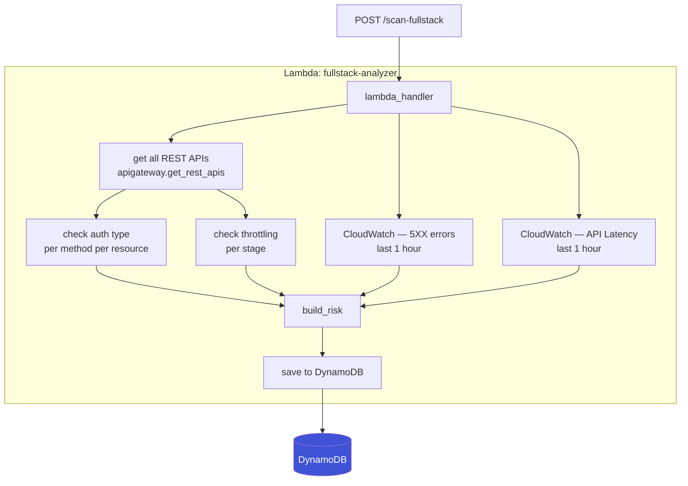
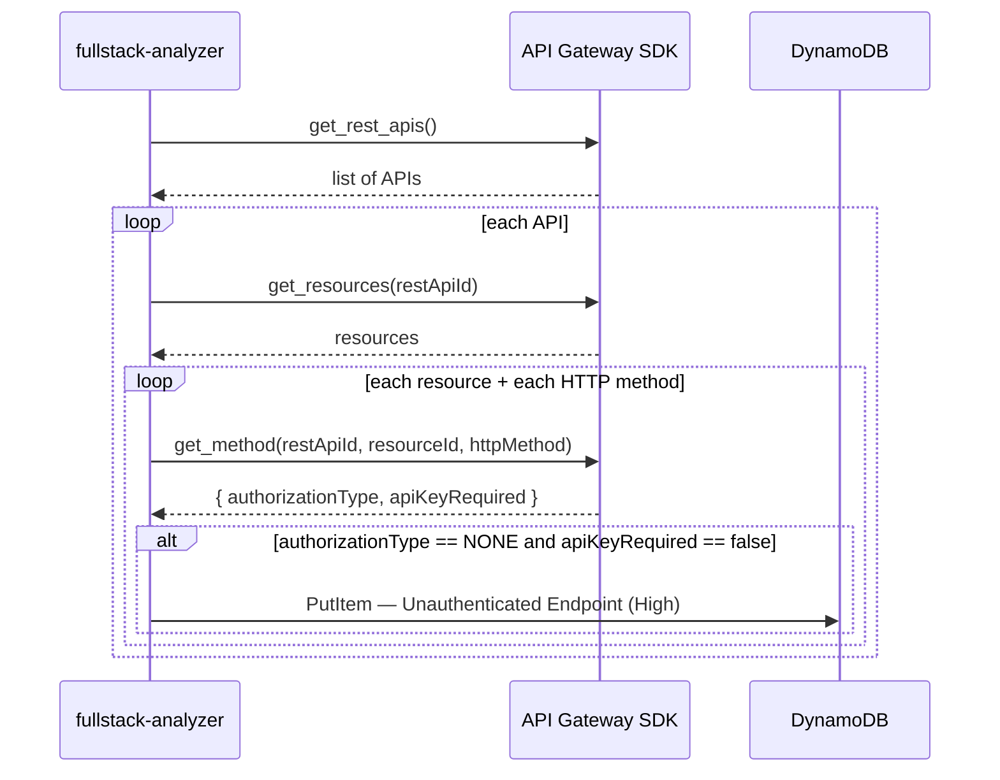
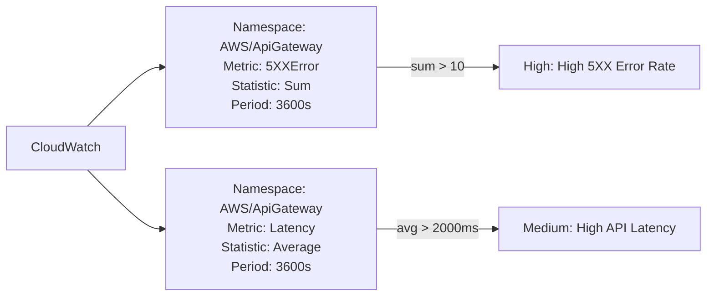
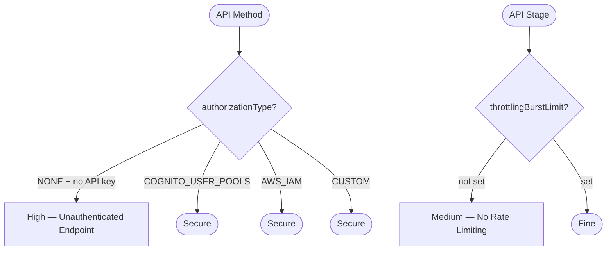

# Architecture — Full-Stack Intelligence
## Janapareddy Dyns Gowrish

My module scans API Gateway and CloudWatch. I drew these diagrams to explain what happens when the scan runs.

---

## Module flow

---

## How I check authentication

That's the key check. If someone deploys an API with no Cognito, no IAM, no API key — it gets flagged.

---

## CloudWatch metrics I use

In a fresh account these return no data so the checks just don't trigger anything. Once APIs are deployed and getting traffic, this becomes useful.

---

## Priority logic

