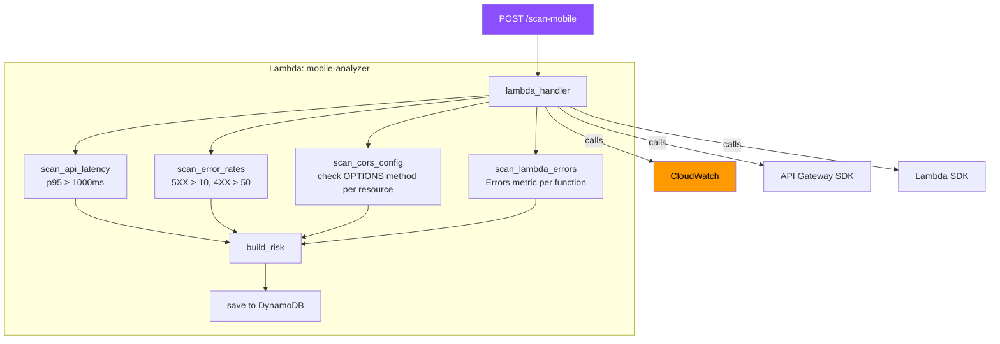
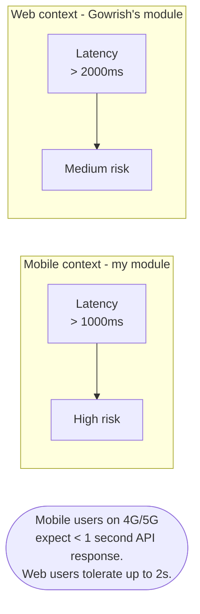
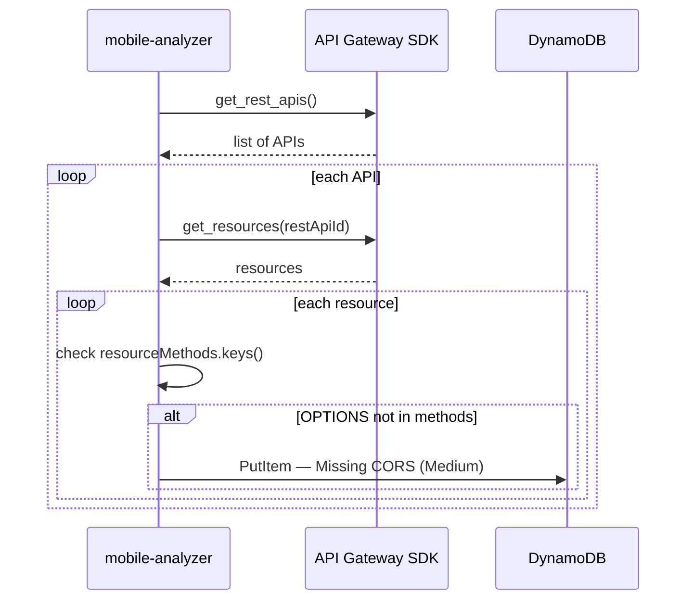
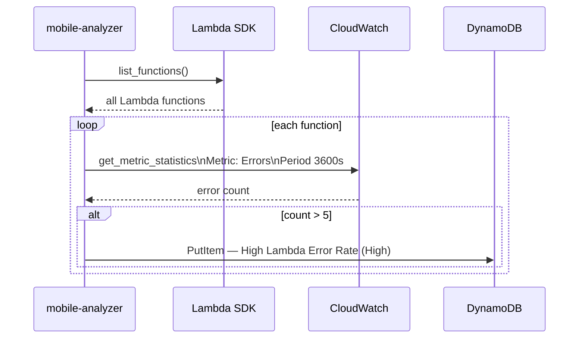

# Architecture — Mobile Backend Intelligence
## Muramalla Ambica Sai Ram

Notes on how my module is structured. Key difference from Gowrish's module: I use 1000ms as the latency threshold instead of 2000ms, and I also check CORS and Lambda error rates — both are critical for mobile backends.

---

## Module flow

---

## Mobile vs Web latency — why the different threshold

I talked to Gowrish about this early on. He uses 2000ms for web APIs. I use 1000ms. The reason:

---

## CORS check

This is specifically relevant for Flutter Web and hybrid apps. Native Flutter doesn't trigger browser CORS checks, but Flutter Web does.

---

## Lambda error detection

